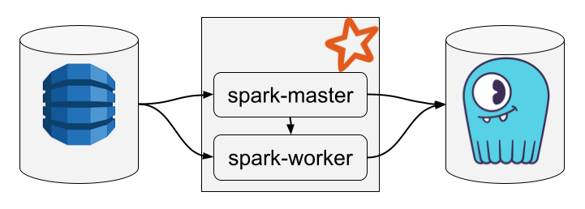
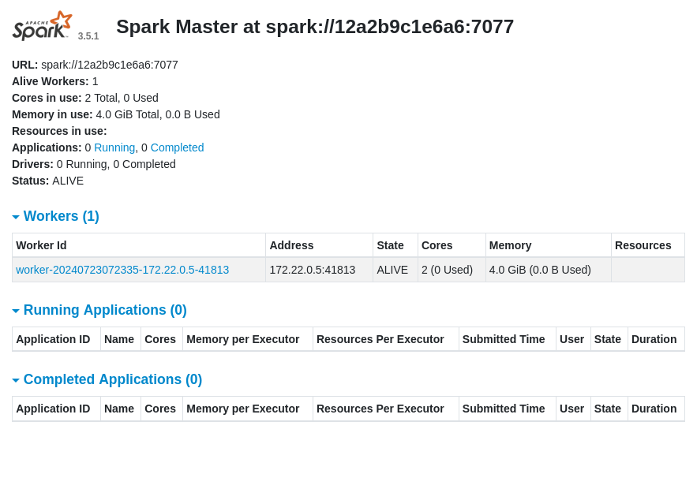
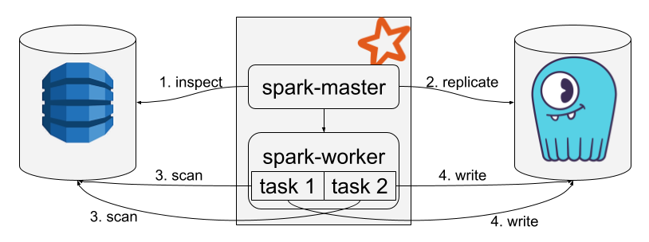
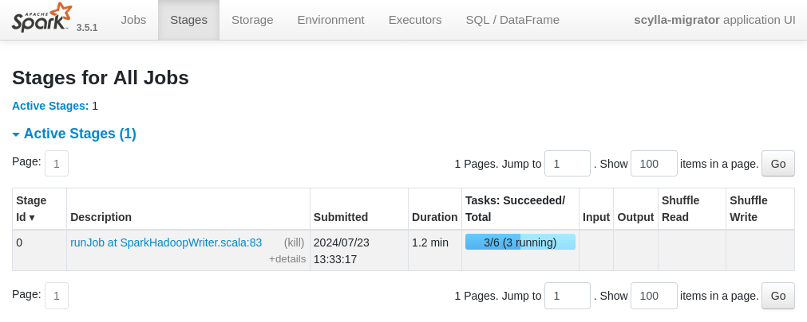

=========================================================
Migrate from DynamoDB to ScyllaDB Alternator Using Docker
=========================================================

In this tutorial, you will replicate 1,000,000 items from a DynamoDB table to ScyllaDB Alternator.

All the scripts and configuration files shown on the tutorial can be found in our `GitHub repository <https://github.com/scylladb/scylla-migrator/tree/master/docs/source/tutorials/dynamodb-to-scylladb-alternator>`_.

The whole system is composed of the DynamoDB service, a Spark cluster with a single worker node, and a ScyllaDB cluster with a single node, as illustrated below:

To follow this tutorial, you need to install `Docker <https://docker.com>`_ and the `AWS CLI <https://aws.amazon.com/cli/>`_.

----------------------------------------------------
Set Up the Services and Populate the Source Database
----------------------------------------------------

In an empty directory, create the following ``docker-compose.yaml`` file to define all the services:

.. literalinclude:: docker-compose.yaml
  :language: YAML

Let’s break down this Docker Compose file.

1. We define the DynamoDB service by reusing the official image ``amazon/dynamodb-local``. We use the TCP port 8000 for communicating with DynamoDB.
2. We define the Spark master and Spark worker services by using a custom image (see below). Indeed, the official Docker images for Spark 3.5.1 only support Scala 2.12 for now, but we need Scala 2.13. We mount the local directory ``./spark-data`` to the Spark master container path ``/app`` so that we can supply the Migrator jar and configuration to the Spark master node. We expose the ports 8080 and 4040 of the master node to access the Spark UIs from our host environment. We allocate 2 cores and 4 GB of memory to the Spark worker node. As a general rule, we recommend allocating 2 GB of memory per core on each worker.
3. We define the ScyllaDB service by reusing the official image ``scylladb/scylla``. We use the TCP port 8001 for communicating with ScyllaDB Alternator.

Create the ``Dockerfile`` required by the Spark services at path ``./dockerfiles/spark/Dockerfile`` and write the following content:

.. literalinclude:: dockerfiles/spark/Dockerfile
  :language: Dockerfile

This ``Dockerfile`` installs Java and a Spark distribution. It uses a custom shell script as entry point. Create the file ``./dockerfiles/spark/entrypoint.sh``, and write the following content:

.. literalinclude:: dockerfiles/spark/entrypoint.sh
  :language: sh

The entry point takes an argument that can be either ``master`` or ``worker`` to control whether to start a master node or a worker node.

Prepare your system for building the Spark Docker image with the following commands, which create the ``spark-data`` directory and make the entry point executable:

.. code-block:: sh

  mkdir spark-data
  chmod +x entrypoint.sh

Finally, start all the services with the following command:

.. code-block:: sh

  docker compose up

Your system's Docker daemon will download the DynamoDB and ScyllaDB images and build your Spark Docker image.

Check that you can access the Spark cluster UI by opening http://localhost:8080 in your browser. You should see your worker node in the workers list.

Once all the services are up, you can access your local DynamoDB instance and your local ScyllaDB instance by using the standard AWS CLI. Make sure to configure the AWS CLI as follows before running the ``dynamodb`` commands:

.. code-block:: sh

  # Set dummy region and credentials
  aws configure set region us-west-1
  aws configure set aws_access_key_id dummy
  aws configure set aws_secret_access_key dummy
  # Access DynamoDB
  aws --endpoint-url http://localhost:8000 dynamodb list-tables
  # Access ScyllaDB Alternator
  aws --endpoint-url http://localhost:8001 dynamodb list-tables

The last preparatory step consists of creating a table in DynamoDB and filling it with random data. Create a file named ``create-data.sh``, make it executable, and write the following content into it:

.. literalinclude:: create-data.sh
  :language: sh

This script creates a table named ``Example`` and adds 1 million items to it. It does so by invoking another script, ``create-25-items.sh``, which uses the ``batch-write-item`` command to insert 25 items in a single call:

.. literalinclude:: create-25-items.sh
  :language: sh

Every added item contains an id and five columns, all filled with random data.
Run the script ``./create-data.sh`` and wait for a couple of hours until all the data is inserted (or change the last line of ``create-data.sh`` to insert fewer items).

---------------------
Perform the Migration
---------------------

Once you have set up the services and populated the source database, you are ready to perform the migration.

Download the latest stable release of the Migrator in the ``spark-data`` directory:

.. code-block::

  wget https://github.com/scylladb/scylla-migrator/releases/latest/download/scylla-migrator-assembly.jar \
    --directory-prefix=./spark-data

Create a configuration file in ``./spark-data/config.yaml`` and write the following content:

.. literalinclude:: spark-data/config.yaml
  :language: YAML

This configuration tells the Migrator to read the items from the table ``Example`` in the ``dynamodb`` service, and to write them to the table of the same name in the ``scylla`` service.

Finally, start the migration with the following command:

.. literalinclude:: run-migrator.sh
  :language: sh

This command calls ``spark-submit`` in the ``spark-master`` service with the file ``scylla-migrator-assembly.jar``, which bundles the Migrator and all its dependencies.

In the ``spark-submit`` command invocation, we explicitly tell Spark to use 4 GB of memory; otherwise, it would default to 1 GB only. We also explicitly tell Spark to use 2 cores. This is not really necessary as the default behavior is to use all the available cores, but we set it for the sake of illustration. If the Spark worker node had 20 cores, it would be better to use only 10 cores per executor to optimize the throughput (big executors require more memory management operations, which decrease the overall application performance). We would achieve this by passing ``--executor-cores 10``, and the Spark engine would allocate two executors for our application to fully utilize the resources of the worker node.

The migration process inspects the source table, replicates its schema to the target database if it does not exist, and then migrates the data. The data migration uses the Hadoop framework under the hood to leverage the Spark cluster resources. The migration process breaks down the data to transfer chunks of about 128 MB each, and processes all the partitions in parallel. Since the source is a DynamoDB table in our example, each partition translates into a `scan segment <https://docs.aws.amazon.com/amazondynamodb/latest/developerguide/Scan.html#Scan.ParallelScan>`_ to maximize the parallelism level when reading the data. Here is a diagram that illustrates the migration process:

During the execution of the command, a lot of logs are printed, mostly related to Spark scheduling. Still, you should be able to spot the following relevant lines:

.. code-block:: text

  24/07/22 15:46:13 INFO migrator: ScyllaDB Migrator 0.9.2
  …
  24/07/22 15:46:20 INFO alternator: We need to transfer: 2 partitions in total
  24/07/22 15:46:20 INFO alternator: Starting write…
  24/07/22 15:46:20 INFO DynamoUtils: Checking for table existence at destination

And when the migration ends, you will see the following line printed:

.. code-block:: text

  24/07/22 15:46:24 INFO alternator: Done transferring table snapshot

During the migration, it is possible to monitor the underlying Spark job by opening the Spark UI available at http://localhost:4040.

`Example of a migration broken down in 6 tasks. The Spark UI allows us to follow the overall progress, and it can also show specific metrics such as the memory consumption of an executor`.

In our example the size of the source table is ~200 MB. In practice, it is common to migrate tables containing several terabytes of data. If necessary, and as long as your DynamoDB source supports a higher read throughput level, you can increase the migration throughput by adding more Spark worker nodes. The Spark engine will automatically spread the workload between all the worker nodes.

